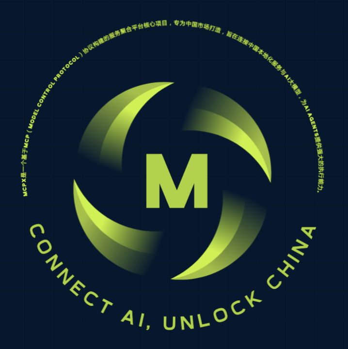

  

<h2 align="center">
  基于MCP协议的中国服务聚合平台
</h2>

# MCPX

MCPX是一个基于MCP（Model Control Protocol）协议构建的服务聚合平台核心项目，专为中国市场打造，旨在连接中国本地化服务与AI大模型，为AI Agents提供强大的执行能力。

## 📚 项目简介

MCPX通过MCP协议将各类中国本地服务以标准化方式聚合并提供给AI模型，使AI能够便捷地调用外部服务资源，实现更加智能化的任务处理。作为一个开源项目，MCPX致力于构建一个繁荣的开发者生态，共同推动中国AI应用的落地与创新。

## 🌟 核心价值

- **服务聚合**：整合中国本土各类API服务，包括电商、支付、出行、内容等
- **标准化接入**：提供统一的MCP协议标准，简化AI与服务的连接
- **本地化优势**：专注中国市场需求，提供符合本地用户习惯的服务接口
- **开放生态**：鼓励开发者贡献服务适配器，共同丰富服务生态

## 🔍 什么是MCP协议？

MCP（Model Control Protocol）是一种专为大模型AI设计的服务交互协议标准，它允许AI模型通过标准化接口调用外部服务。MCPX在实现此协议的基础上，进一步优化并扩展其功能，使其更适合中国市场的特定需求。

## 🚀 项目愿景

- 成为中国市场最全面的AI服务聚合平台
- 建立完善的开源社区，吸引众多开发者参与贡献
- 提供高质量的中文文档和支持，降低开发门槛
- 促进AI与各行业的深度融合，加速智能化转型

## 🛠️ 计划功能（开发中）

- **丰富的服务接口**：包括支付宝、微信、淘宝、京东、美团、抖音等中国主流服务
- **统一的身份认证**：支持多种认证协议（OAuth、API密钥、JWT等）
- **开发者工具集**：提供便捷的开发、测试和部署工具
- **高效的服务调度**：智能化的服务调用与响应处理机制
- **完善的文档体系**：全面的中文技术文档与示例代码

## 📋 项目路线图

| 阶段 | 计划 | 状态 |
|------|------|------|
| **Phase 1** | MCP协议标准化及核心框架搭建 | 进行中 |
| **Phase 2** | 基础服务接口开发与集成 | 计划中 |
| **Phase 3** | 开发者工具与文档完善 | 计划中 |
| **Phase 4** | 生态拓展与社区建设 | 计划中 |

## 🤝 如何参与贡献

MCPX是一个开源项目，我们诚挚邀请各位开发者参与贡献。您可以通过以下方式加入我们：

1. **代码贡献**：提交Pull Request，参与核心功能开发
2. **服务接入**：开发新的服务适配器，丰富服务生态
3. **文档完善**：优化技术文档，提供使用示例
4. **问题反馈**：提交Issue，帮助我们改进项目
5. **社区讨论**：分享想法，参与技术讨论

## 💡 应用场景

- **智能助手**：帮助用户预订机票、酒店、餐厅等
- **内容创作**：自动整合多平台内容资源
- **企业自动化**：连接企业内外部系统，实现智能化工作流
- **电商助手**：跨平台比价、商品搜索、下单等
- **数据分析**：连接各类数据服务，提供智能分析

## 📬 联系我们

- **GitHub Issues**：[提交问题或建议](https://github.com/your-org/mcpx/issues)
- **社区交流群**：（待建立）
- **官方网站**：（建设中）

## ⭐ 感谢所有贡献者

项目刚刚启动，期待您的加入！

---

MCPX - 连接AI与中国服务的桥梁

